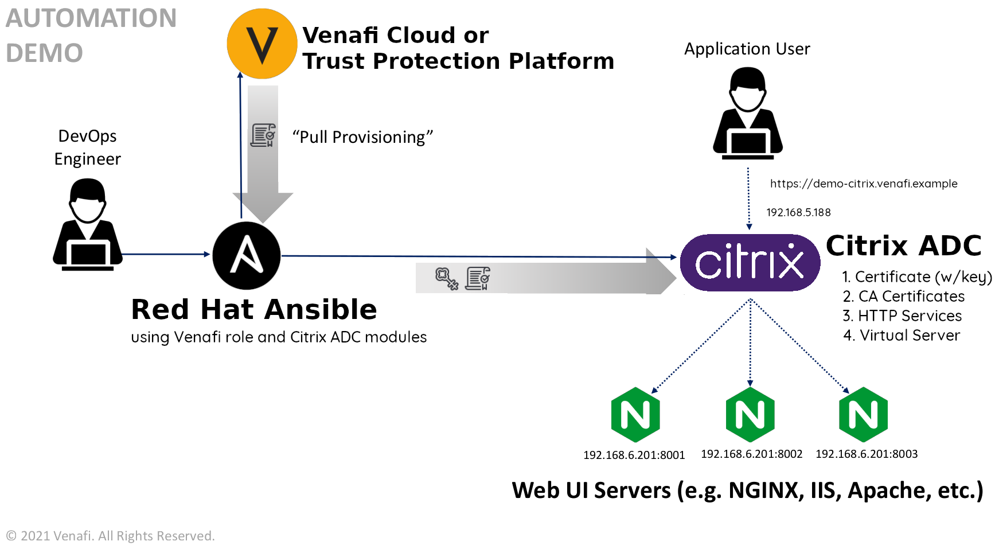

# Configuring SSL termination with Venafi Ansible Role on a set of HTTP servers that are load balanced by Citrix ADC

This example describes the configuration steps required in order to generate a certificate using the Venafi Ansible Role and its installation on a [Citrix ADC](https://www.citrix.com/products/citrix-adc/) instance in order to load balance a set of http servers and provide [SSL Termination](https://en.wikipedia.org/wiki/TLS_termination_proxy).

## Personas

The steps described in this document are typically performed by a **DevOps Engineer** or a **Systems Administrator**.

## Scenario

An Application Delivery Controller (ADC) is used to increase capacity and reliability of applications, it improves the performance of applications by decreasing the load on the servers associated while managing and maintaining application and network sessions, however its configuration can become a long process, a configuration management tool can be used in order to automate this process.

In this example the ADC used is a Citrix ADC, which once configured should load balance traffic in a cluster of 3 HTTP servers as well as providing SSL termination to it.

## Solution

Use [RedHat Ansible](https://www.ansible.com/) to automate the process of requesting and retrieving a certificate, installing it and configuring Citrix ADC to use it to provide SSL termination and load balancing capabilities to a cluster composed of 3 HTTP servers.

1. Retrieve a certificate using the Venafi Ansible Role.
2. Copy the certificate files retrieved to the Citrix ADC.
3. Create certificate-key pair on Citrix ADC.
4. Create HTTP back end services on Citrix ADC.
5. Create a Virtual Server on Citrix ADC.

## Prerequisites

> *Note: The sole purpose of the credentials used in this example is illustrative, in a real life scenario they must be considered as weak and insecure.*


To perform the tasks described in this example, you'll need:

- The Venafi Ansible Role installed on your machine, you can install it using `ansible-galaxy` [as described here](https://github.com/Venafi/ansible-role-venafi#using-with-ansible-galaxy)
- Access to either **Venafi Trust Protection Platform** or **Venafi Cloud** services (the `credentials.yml` [file](https://github.com/Venafi/ansible-role-venafi#using-with-ansible-galaxy) is used in this example).
  - If you are working with **Venafi Trust Protection Platform** obtain the `access_token` and `refresh_token` using the [VCert CLI](https://github.com/Venafi/vcert/blob/master/README-CLI-PLATFORM.md#obtaining-an-authorization-token).
- Administration access to the Citrix ADC instance. 
- Nitro Python SDK (available from https://www.citrix.com/downloads/netscaler-adc or from the "Downloads" tab of the Citrix ADC GUI).
- Citrix ADC modules for Ansible installed from `ansible-galaxy` (installation can be performed following this [guide](https://github.com/citrix/citrix-adc-ansible-modules#installation)).
- A set of 3 NGINX servers running your application.

## Scenario Introduction

In this example you are going to generate a certificate for the `demo-citrix.venafi.example` domain using the Venafi Ansible Role to request it and retrieve it from either **Venafi Trust Protection Platform** or **Venafi Cloud** services. Then you are going to copy the certificate files (certificate, private key, chain Bundle) to the Citrix ADC. Finally you are going to configure Citrix ADC to distribute the traffic between 3 NGINX servers using the round-robin load balancing method. Here below you can find a diagram of what we are trying to accomplish.

> *Note: The steps provided in this example suggest the use of the round-robin balancing method, bear in mind there are [other methods](https://docs.citrix.com/en-us/citrix-adc/current-release/load-balancing/load-balancing-customizing-algorithms.html) that may be more suitable for your use case scenario.*



## Retrieving certificate using Venafi Ansible Role

### Creating variables file

The first step is to create the `variables.yaml` file, in this file are defined the variables used during the execution of the playbook such as:

- The Citrix ADC management IP address.
- The credentials used to manage the Citrix ADC.
- The CN needed to generate the certificate.
- The Virtual IP and port on which all the HTTPS traffic will be handled.
- The http services (the NGINX servers running the application).
- The name for the certificate files which will be copied to the Citrix ADC. 

```yaml

adc_address: "192.168.5.188"
adc_username: "youruser"
adc_password: "yourpassword"

test_site:
  name: "demo-citrix"
  domain: "venafi.example"

adc_virtual_ip: "192.168.3.167"
adc_virtual_port: "443"

http_service: 192.168.6.201
port1: 8001
port2: 8002
port3: 8003
    
cert_name: "{{ test_site.name }}.crt"
key_name: "{{ test_site.name }}.key"
chain_name: "{{ test_site.name }}-ca-bundle.crt"
```

### Creating the playbook

Start by creating a YAML file named `citrix_create_playbook.yaml`, inside, define a name for the playbook, the hosts in which the tasks will be executed, the type of connection to use, the Citrix ADC collection and specify the variables file created in the previous step :

```yaml
- name: Create Critx ADC Application
  hosts: localhost
  connection: local
  collections: citrix.adc

  vars_files:
    - variables.yaml
```


### Requesting and retrieving the certificate using Venafi Role

In the following block of instructions the Venafi Ansible Role is being specified along with the variables it needs to request and retrieve the certificate from the Venafi services, by adding these instructions the Ansible Role will:

- Request and retrieve a certificate which common and alternate names are `demo-citrix.venafi.example`.
- Create a RSA private key of a size of 2048 bits.
- Generate a chain bundle file where the CA certificate will be place at the end of the file.
- Create a `tmp` directory on the current working directory which will store the retrieved certificate files.
  - 3 files will be retrieved and stored using the names on the variables file (*demo-citrix.{crt,key,-ca-bundle.crt}*).
- Simulate the copy of the retrieved files to the remote host by generating a duplicate of them adding the `.remote` extension (the certificate files retrieved are going to be copied to the Citrix ADC using the Citrix ADC Ansible modules that's the reason why the options `certificate_copy_private_key_to_remote` and `certificate_remote_execution` are set to `false`).


```yaml
---

  roles:
    - role: venafi.ansible_role_venafi

      certificate_common_name: "{{ test_site.name }}.{{ test_site.domain }}"
      certificate_alt_name: "DNS:{{ test_site.name }}.{{ test_site.domain }}"
      certificate_privatekey_type: "RSA"
      certificate_privatekey_size: "2048"
      certificate_chain_option: "last"

      certificate_cert_dir: "./tmp"
      certificate_cert_path: "./tmp/{{ cert_name }}"
      certificate_chain_path: "./tmp/{{ chain_name }}"
      certificate_privatekey_path: "./tmp/{{ key_name }}"
      certificate_copy_private_key_to_remote: false

      certificate_remote_execution: false
      certificate_remote_privatekey_path: "./tmp/{{ key_name }}.remote"
      certificate_remote_cert_path: "./tmp/{{ cert_name }}.remote"
      certificate_remote_chain_path: "./tmp/{{ chain_name }}.remote"
```

## Copying certificate files to Citrix ADC

By adding the instructions below to the playbook, we indicate the actions the  playbook will execute. Ansible will connect to the Citrix ADC (using the credentials specified in the variables file) and then it will create the key, CA bundle and certificate using the local files retrieved in the previous step.


```yaml
---

  tasks:
    - name: Copy Private Key to Citrix ADC {{ adc_address }}
      citrix_adc_system_file:
        nsip: "{{ adc_address }}"
        nitro_user: "{{ adc_username }}"
        nitro_pass: "{{ adc_password }}"
        nitro_protocol: http
        validate_certs: false
        state: present
        filename: "{{ key_name }}"
        filelocation: "/nsconfig/ssl/"
        filecontent: "{{ lookup('file', './tmp/' + key_name) }}"
      delegate_to: localhost

    - name: Copy Certificate to Citrix ADC {{ adc_address }}
      citrix_adc_system_file:
        nsip: "{{ adc_address }}"
        nitro_user: "{{ adc_username }}"
        nitro_pass: "{{ adc_password }}"
        nitro_protocol: http
        validate_certs: false
        state: present
        filename: "{{ cert_name }}"
        filelocation: "/nsconfig/ssl/"
        filecontent: "{{ lookup('file', './tmp/' + cert_name + '.remote') }}"
      delegate_to: localhost

    - name: Copy CA Bundle to Citrix ADC {{ adc_address }}
      citrix_adc_system_file:
        nsip: "{{ adc_address }}"
        nitro_user: "{{ adc_username }}"
        nitro_pass: "{{ adc_password }}"
        nitro_protocol: http
        validate_certs: false
        state: present
        filename: "{{ chain_name }}"
        filelocation: "/nsconfig/ssl"
        filecontent: "{{ lookup('file', './tmp/' + chain_name + '.remote') }}"
      delegate_to: localhost

```

### Creating http services on Citrix ADC

Once the files copied to the Citrix ADC, Ansible needs to create the http services in the Citric ADC instance, those services are the ones that will actually serve the requests (NGINX servers hosting the application), Ansible will use the host and port variables defined in the variables file for each one of them. 

```yaml
---

    - name: Create service-http-1 on Citrix ADC {{ adc_address }}
      citrix_adc_service:
        nsip: "{{ adc_address }}"
        nitro_user: "{{ adc_username }}"
        nitro_pass: "{{ adc_password }}"
        nitro_protocol: http
        validate_certs: false
        state: present
        name: service-http-1
        servicetype: HTTP
        ip: "{{ http_service }}"
        ipaddress: "{{ http_service }}"
        port: "{{ port1 }}"
      delegate_to: localhost

    - name: Create service-http-2 on Citrix ADC {{ adc_address }}
      citrix_adc_service:
        nsip: "{{ adc_address }}"
        nitro_user: "{{ adc_username }}"
        nitro_pass: "{{ adc_password }}"
        nitro_protocol: http
        validate_certs: false
        state: present
        name: service-http-2
        servicetype: HTTP
        ip: "{{ http_service }}"
        ipaddress: "{{ http_service }}"
        port: "{{ port2 }}"
      delegate_to: localhost

    - name: Create service-http-3 on Citrix ADC {{ adc_address }}
      citrix_adc_service:
        nsip: "{{ adc_address }}"
        nitro_user: "{{ adc_username }}"
        nitro_pass: "{{ adc_password }}"
        nitro_protocol: http
        validate_certs: false
        state: present
        name: service-http-3
        servicetype: HTTP
        ip: "{{ http_service }}"
        ipaddress: "{{ http_service }}"
        port: "{{ port3 }}"
      delegate_to: localhost
```

### Creating Virtual server on Citrix ADC

Now that the http services have been create, Ansible has to create a virtual IP address in order to send the external requests to the pool members. The following task creates the virtual server and assigns it the virtual IP defined in the variables file, the port, the certificate-key pair and the http services previously created, as well as the round-robin load balancing [method](https://docs.citrix.com/en-us/citrix-adc/current-release/load-balancing/load-balancing-customizing-algorithms.html) which will allow the virtual server to distribute the load between the NGINX servers hosting the application.

```yaml
---

    - name: Create lb vserver on Citrix ADC {{ adc_address }}
      citrix_adc_lb_vserver:
        nsip: "{{ adc_address }}"
        nitro_user: "{{ adc_username }}"
        nitro_pass: "{{ adc_password }}"
        nitro_protocol: http
        validate_certs: false
        state: present
        name: "vs-{{ test_site.name }}.{{ test_site.domain }}" 
        servicetype: SSL
        timeout: 2
        ipv46: "{{ adc_virtual_ip }}"
        port: "{{ adc_virtual_port }}"
        lbmethod: ROUNDROBIN
        ssl_certkey: "{{ test_site.name }}.{{ test_site.domain }}_certkey" 
        servicebindings:
          - servicename: service-http-1
            weight: 80
          - servicename: service-http-2
            weight: 60
          - servicename: service-http-3
            weight: 40
        disabled: no
      delegate_to: localhost

```

## Executing the playbook

Once the [playbook completed](citrix_create_playbook.yaml), it can be executed by running the command below:

```bash
ansible-playbook citrix_create_playbook.yaml --ask-vault-pass
```

If you followed the above steps correctly, you should see output similar to what is shown below.

[](https://asciinema.org/a/d9BlbbXWGNFcSzQUkIAeJ0Qcr)

## Reversing the changes performed

In this example we are including a playbook that allows to revert the changes performed, you can take a look at it [here](citrix_delete_playbook.yaml), it can be executed by running:

```bash
ansible-playbook citrix_delete_playbook.yaml
```
